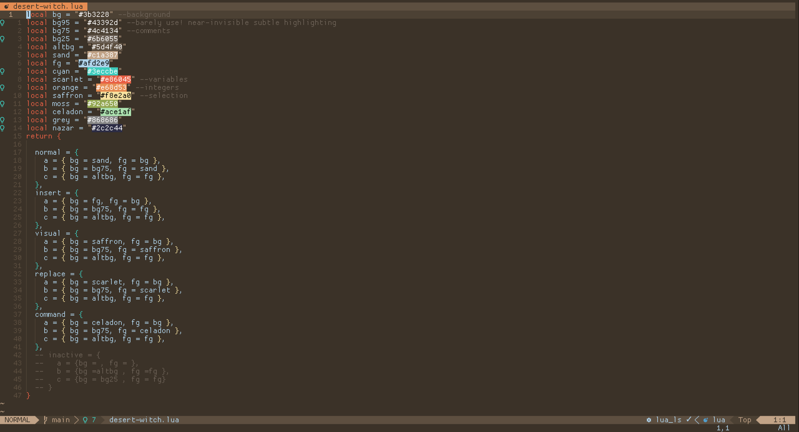

# desert-witch.nvim

An earthy, mystical color palette.


## Features:

- Warm, quiet colors, focusing on shades of brown.
- hand-picked syntax highlighting, balancing clarity, minimalism, and aesthetics.
- special bold/italics highlighting for featureless fonts.

### Plugin Support

- [TreeSitter](https://github.com/nvim-treesitter/nvim-treesitter)
- [RenderMarkdown](https://github.com/MeanderingProgrammer/render-markdown.nvim)
- [Git Signs](https://github.com/lewis6991/gitsigns.nvim)
- [WhichKey](https://github.com/liuchengxu/vim-which-key)
- [RainbowDelimiter](https://github.com/HiPhish/rainbow-delimiters.nvim)
- [Blink.cmp](https://github.com/saghen/blink.cmp)
- [mini.tabline](https://github.com/nvim-mini/mini.tabline)
- [mini.hipatterns](https://github.com/nvim-mini/mini.hipatterns/)
- and more!

## Installation:

using vim.pack.add (Neovim v0.12+)

```
vim.pack.add({"https://codeberg.org/trickyni/desert-witch.nvim/src/branch/main"})
vim.cmd("colorscheme desert-witch")
```

using [lazy.nvim](https://github.com/folke/lazy.nvim):

```
{
  "https://codeberg.org/trickyni/desert-witch.nvim/src/branch/main",
  lazy = false,
  priority = 1000,
  config = function()
    vim.cmd("colorscheme desert-witch")
  end,
}
```

## Future plans:

- [ ] Lualine theme
- [ ] Detailed breakdown of the palette and the use for each color
- [ ] Support for more plugins and bespoke tailoring for more languages

## Feedback welcome!

Desert Witch is mainly tested on QML, Javascript, CSS and HTML, and is tweaked for the plugins I personally enjoy.

If you're readiding this:  
First, thank you for taking a moment to appreciate my personal love-letter to the color brown.  
Second: If you'd like to extend this theme, (or if you'd like me to do it!)
please, make some noise!

## Inspiration

- [Nord theme](https://www.nordtheme.com/)
- [Tonsky.me: I am sorry, but everyone is getting syntax highlighting wrong](https://tonsky.me/blog/syntax-highlighting/)
- [mini.base16](https://github.com/nvim-mini/mini.base16)
- [ymir.nvim](https://github.com/Ronxvier/ymir.nvim/tree/main)
